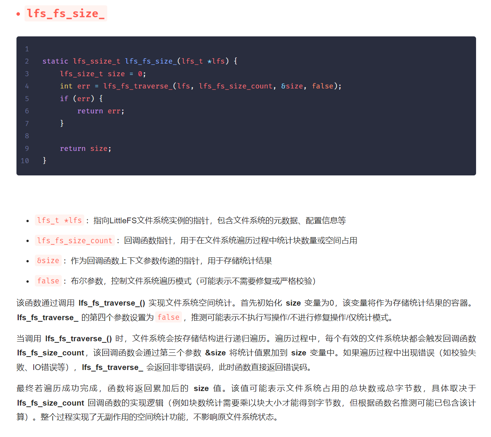

# 第八周（2月26日）

在继续阅读和分析代码的过程中，我发现相对于前半部分的工具函数和相对独立的小函数（基本不调用其他函数），函数逻辑复杂程度显著上升。而且即使完全理解了一个函数，将理解进行文档化（列出其每个参数的作用和代码的核心运行逻辑）依然要花很多时间，这会拖慢进度。

因此我撰写脚本，调用deepseek的api先生成剩余文档。对剩余近100个函数生成数万字的分析。

当然，目前AI能力有限，依然可能出现严重的理解错误。而且由于输入窗口限制，AI也无法结合完整的LFS代码分析。例如下列函数的分析中，AI没有按照提示词仅对参数列出分析的无序列表。

在生成性文档的基础上，我可以省去大量的体力劳动，AI生成的内容也可以帮助我理解代码，我只需在理解后修正其内容即可，可按计划，在下周完成littlefs的代码理解工作。

*距离周报正常的撰写日期(2月5日)已过两天。但是因为之前是春节。基本没有时间继续工作，所以又攒了一点内容延迟到今天。*

