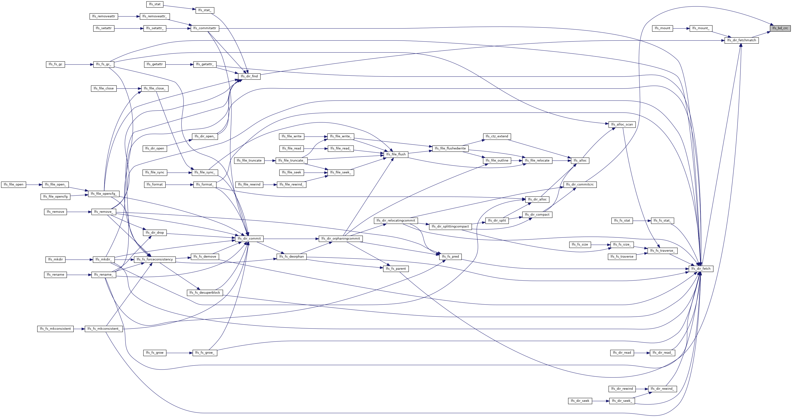

# littlefs源码理解

## ez?

littlefs的完整实现仅由`lfs.h`,`lfs.c`,`lfs_utils.h`,`lfs_utils.c`四个文件组成。

`lfs_utils.h`和`lfs_utils.c`主要定义和实现了一些短小精悍的工具函数，理解起来基本上毫无困难。

`lfs.h`主要定义了对外提供的函数结构以及实现中内部要使用的各类结构体、枚举和函数等，阅读起来也基本没什么困难。

## 调用关系

虽然之前已经翻译和阅读了`littlefs`的

但`lfs.c`的组成就非常复杂了，我希望能够在移植这部分代码前尽可能充分的理解每一个函数在干什么，设计这些函数的意图，以及它们之间的关系是什么。为了避免在阅读某个函数并进行dfs时，因为依赖层级过多导致自己的大脑栈溢出，我希望先使用工具厘清这些函数间的调用关系。

最初我使用希望使用`GNU cflow`输出树状调用关系，然而即使我确认我正确安装并使用了正确的指令，`cflow`就是无法输出结果，后来我分别使用以下命令：

```bash
cflow --main [simple_function_name] lfs.c
cflow --main [complex_function_name] lfs.c
```

结果是前者有输出而后者没有，可以想到原因应该是`lfs.c`本身和其中的某些函数的复杂性已经超越了`GNU_flow`这个和我一样大的老家伙的分析极限。

于是我转求`Doxygen`+`Graphviz`来进行自动分析调用关系，但是当我看到结果的时候还是沉默了。

以下是`lfs_file_open`函数的调用关系图：



What the hell??这样的关系图可以说对我们阅读和分析毫无帮助。

接下来我打算尝试使用工具或撰写代码自动完成这些函数的分级：

* 0级依赖的函数
  * 不依赖其他任何函数实现的函数 
  * 所有内联函数，即使该内联函数依赖于其他函数，也认为该内联函数是0级依赖的函数 
  * 如果一个函数只依赖于头文件中已经引入的函数（如memcpy,lfs_alignup等函数），也认为它是0级依赖的函数 
* 1级依赖的函数：只依赖0级依赖的函数，且至少依赖一个0级依赖的函数
* 2级依赖的函数：只依赖于0级依赖和1级依赖的函数实现，且至少依赖一个1级依赖的函数 
* n级依赖的函数：只依赖于0~n-1级依赖的函数实现，且至少依赖一个n-1级依赖的函数 

然后依照分级次序，依次阅读每一级的函数。

*写于1月26日*
